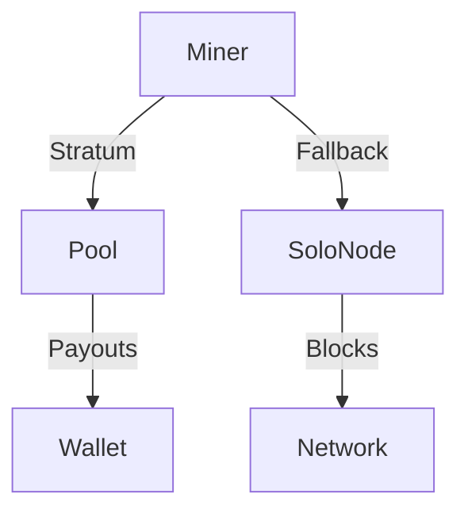

# Mining Architecture

Learn how mining infrastruktura ZION TerraNova funguje a jak optimalizovat svůj výkon.

## RandomX základ

- **CPU friendly**: navrženo pro běžné procesory.
- **ASIC resistant**: brání centralizaci hashrate.
- **Memory hard**: doporučujeme 4 GB RAM na instanci.
- **Quantum aware**: připraveno na budoucí kryptografii.

## Hardwarové profily

| Profil | Hashrate | Spotřeba | Poznámka |
| --- | --- | --- | --- |
| Solo Ryzen 9 | 14 kH/s | 130 W | Doporučený home rig |
| Rack EPYC | 65 kH/s | 420 W | Data centrum, NUMA pinning |
| GPU Hybrid | 22 kH/s | 260 W | Experimentální Argon2 varianta |

```bash
# Příklad nastavení hugepages
sudo sysctl -w vm.nr_hugepages=128

# Optimalizace governor
for cpu in /sys/devices/system/cpu/cpu*/cpufreq/scaling_governor; do
  echo performance | sudo tee "$cpu"
done
```

## Síťová architektura



- **Stratum Pools**: `stratum+tcp://pool.zion.earth:3912`
- **Solo**: `zion-node --mining solo`
- **Failover**: doporučujeme minimálně dvě adresy.

## Konfigurace mineru

```ini
[mining]
threads = 12
wallet = zion1qxy...
pool = stratum+tcp://pool.zion.earth:3912
backup_pool = stratum+tcp://backup.zion.earth:3912
```

```bash
./zion-miner --config miner.conf --huge-pages --power-save
```

## Monitoring

- **Prometheus**: metriky na `:9600`
- **Grafana dashboard**: `deployment/monitoring/zion-mining.json`
- **Alerty**: propad hashrate o 30 % během 10 minut → `severity=warning`

## Bezpečnost

- Odděl peněženku pro pool a payouty.
- Limity připojení přes `fail2ban`
- Šifrovaná komunikace: `stunnel` nebo `WireGuard`

## Optimalizační tipy

1. Benchmarkuj `./zion-miner --benchmark` po každém upgradu.
2. Sleduj teploty (`sensors`) a drž CPU < 80 °C.
3. Využij `--adaptive-threads` pro dynamické zatížení.
4. V poolu nastav `--share-log` pro audit odměn.

---

*Každý hash přibližuje komunitu k plné DAO suverenitě.*
