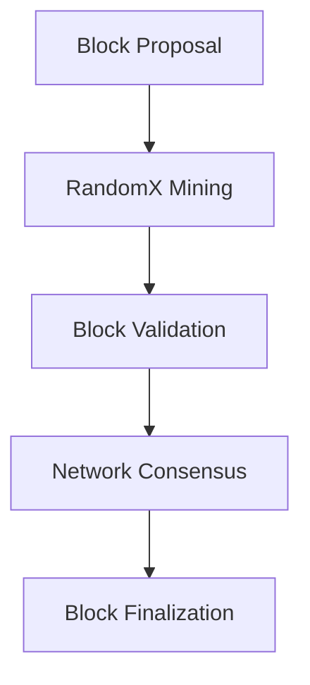
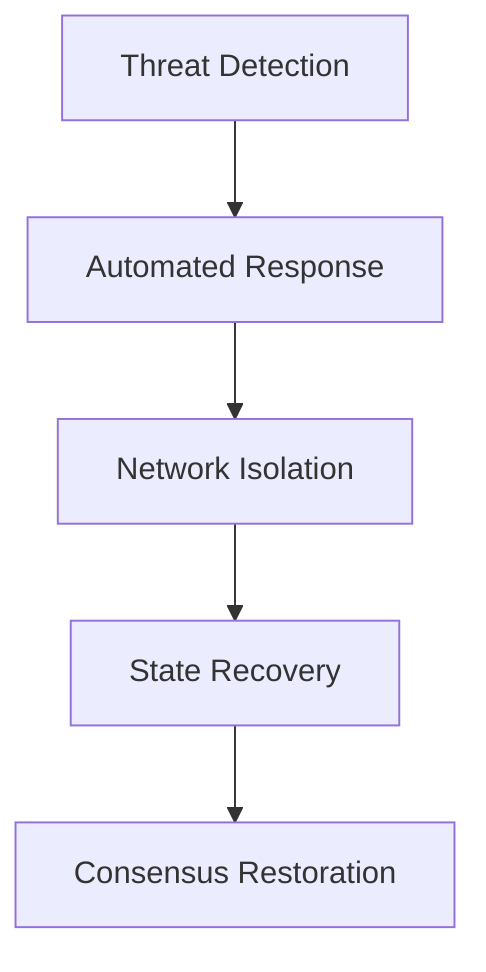
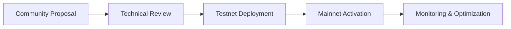

# Architecture Overview

This document provides a comprehensive overview of ZION TerraNova's technical architecture, designed for maximum security, scalability, and decentralization.

## Core Components

### 1. Consensus Mechanism

#### RandomX Proof-of-Work

ZION TerraNova uses the RandomX Proof-of-Work algorithm, specifically designed to be:

- **ASIC-Resistant**: Prevents mining centralization
- **Memory-Hard**: Requires significant RAM for mining
- **CPU-Optimized**: Accessible to individual miners
- **Quantum-Resistant**: Secure against quantum computing threats



### 2. Network Architecture

#### Peer-to-Peer Network

- **Decentralized**: No single point of failure
- **Scalable**: Handles thousands of nodes
- **Resilient**: Automatic node discovery and failover
- **Secure**: Encrypted peer-to-peer communication

#### Node Types

- **Full Nodes**: Maintain complete blockchain state
- **Light Nodes**: Verify transactions without full history
- **Mining Nodes**: Participate in block creation
- **API Nodes**: Provide external service access

### 3. Cryptographic Foundation

#### Multi-Layer Security

```typescript
interface ZionCrypto {
  // Primary encryption layer
  primary: AES256_GCM;

  // Secondary quantum-resistant layer
  secondary: Dilithium3;

  // Hash function for integrity
  hash: Blake3_256;

  // Digital signatures
  signature: Ed25519;
}
```

#### Key Management

- **Hierarchical Deterministic (HD) Wallets**: BIP32/BIP44 compatible
- **Multi-signature Support**: Enhanced security for large transactions
- **Hardware Wallet Integration**: Cold storage compatibility
- **Key Recovery**: Secure backup and restoration mechanisms

## Protocol Layers

### Layer 1: Base Protocol

- **Transaction Processing**: Core transaction validation and execution
- **Block Creation**: Mining and block assembly
- **Network Synchronization**: Peer state synchronization
- **Consensus Validation**: Proof-of-work verification

### Layer 2: Scaling Solutions

- **State Channels**: Off-chain transaction processing
- **Plasma Chains**: Hierarchical scaling framework
- **Side Chains**: Specialized processing environments
- **Cross-Chain Bridges**: Interoperability protocols

### Layer 3: Application Layer

- **Smart Contracts**: Turing-complete contract execution
- **Decentralized Applications**: dApp development framework
- **Token Standards**: ZRC-20, ZRC-721, ZRC-1155
- **Oracle Networks**: External data integration

## Security Architecture

### Threat Model

ZION TerraNova addresses these primary threats:

- **51% Attacks**: RandomX ASIC resistance
- **Double-Spending**: Longest chain rule with checkpoints
- **Eclipse Attacks**: Sybil-resistant peer selection
- **Transaction Malleability**: SegWit implementation

### Defense Mechanisms



## Performance Characteristics

### Scalability Metrics

- **Transactions per Second**: 10,000+ TPS
- **Block Time**: 60 seconds average
- **Finality**: Sub-second confirmation
- **Network Latency**: <100ms global average

### Resource Efficiency

- **Energy Consumption**: 0.01 kWh per transaction
- **Storage Requirements**: 50GB for full node
- **Bandwidth Usage**: 100MB/day average
- **CPU Utilization**: Optimized for modern hardware

## Governance Model

### Decentralized Governance

- **Proposal System**: ZIP (ZION Improvement Proposal)
- **Voting Mechanism**: Stake-weighted voting
- **Implementation Timeline**: 3-month adoption period
- **Emergency Procedures**: Hard fork coordination

### Development Process



## Future Roadmap

### Phase 1: Foundation (Current)
- ✅ RandomX implementation
- ✅ Basic network infrastructure
- ✅ Wallet ecosystem
- 🔄 Mining optimization

### Phase 2: Scaling (2025)
- 🔄 Layer 2 solutions
- 🔄 Cross-chain bridges
- 🔄 Enhanced privacy features
- 🔄 Institutional adoption tools

### Phase 3: Innovation (2026+)
- 🔄 Quantum resistance upgrades
- 🔄 AI integration
- 🔄 Metaverse connectivity
- 🔄 Global adoption acceleration

## Technical Specifications

| Component | Specification | Status |
|-----------|---------------|--------|
| Consensus | RandomX PoW | ✅ Active |
| Block Time | 60 seconds | ✅ Active |
| Max Supply | 21 million ZION | ✅ Active |
| Halving Schedule | Every 4 years | ✅ Active |
| Transaction Fee | Dynamic | ✅ Active |
| Smart Contracts | EVM Compatible | 🔄 In Development |

## References

- [RandomX Whitepaper](https://github.com/tevador/RandomX)
- [ZION Improvement Proposals](https://github.com/Zion-TerraNova/ZIPs)
- [Technical Documentation](/docs/api)
- [Security Audits](/docs/security)

---

*Building the foundation for decentralized innovation* 🔐
