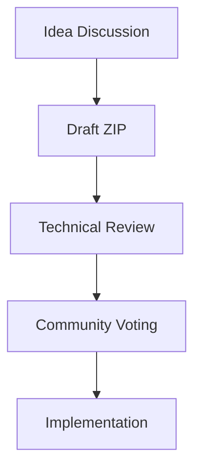

# Community & Ecosystem

Připoj se ke komunitě ZION TerraNova a pomoz tvořit decentralizovanou budoucnost.

## Komunikační kanály

### Discord
- `#general` — každodenní chaty a novinky
- `#testnet-support` — technická pomoc
- `#mining` — tipy na výkon
- `#dev` — vývojová diskuse

### Telegram
- [`@zionterranova`](https://t.me/zionterranova) — oficiální oznámení
- [`@zionmining`](https://t.me/zionmining) — těžba
- [`@ziondev`](https://t.me/ziondev) — vývoj

### Fórum
- dlouhé diskuse, návrhy ZIP a znalostní báze: [forum.zion-terranova.org](https://forum.zion-terranova.org)

## Vývojová komunita

### GitHub organizace
- [ZION Core](https://github.com/Zion-TerraNova/core)
- [Miner](https://github.com/Zion-TerraNova/miner)
- [Wallet](https://github.com/Zion-TerraNova/wallet)
- [SDK](https://github.com/Zion-TerraNova/sdk)

### Jak přispět
1. Forkni repozitář
2. Vytvoř větev
3. Napiš testy a dokumentaci
4. Otevři Pull Request

```javascript
function calculateReward(blockHeight) {
  const halvings = Math.floor(blockHeight / HALVING_INTERVAL);
  return INITIAL_REWARD / Math.pow(2, halvings);
}
```

## Mining komunita

| Pool | Lokace | Fee | Miners |
| --- | --- | --- | --- |
| ZionPool.org | Global | 1 % | 2 340 |
| TerraNova Mining | EU/US | 0.5 % | 1 890 |
| Cosmic Mining | Asia | 1.5 % | 956 |

## Učení a eventy

- **Beginner Track**: blockchain, peněženka, první transakce
- **Developer Track**: smart kontrakty, dApp, API
- **Mining Track**: hardware, pooly, profit

### Eventy
- **ZION Summit 2025** — hybridní konference (Curych + online)
- **Regionální meetupy** — NYC, London, Tokyo, Berlin
- **Hackathon ZION Build 2025** — 50 000 ZION prize pool

## Humanitarian Tithe

5 % odměn směřuje do humanitárních projektů:
- vzdělávání
- zdravotnictví
- environmentální ochrana
- krizová pomoc

Sleduj dopad na [humanitarian.zion-terranova.org](https://humanitarian.zion-terranova.org).

## Governance



| ZIP | Název | Status |
| --- | --- | --- |
| ZIP-001 | Dynamic Fee Adjustment | Voting |
| ZIP-002 | Enhanced Privacy | Draft |
| ZIP-003 | Cross-Chain Bridge | Review |

Hlasuj přes:
- ZION Wallet (`DAO` záložka)
- Web portál [vote.zion-terranova.org](https://vote.zion-terranova.org)
- CLI `zion-cli vote`

---

*Společně tvoříme vědomou ekonomiku.*
